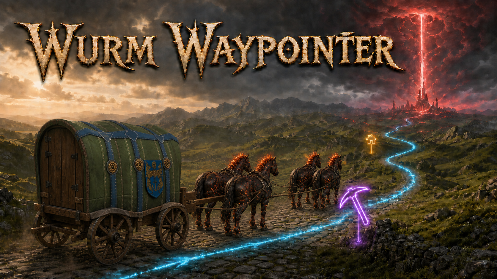

# Wurm Waypointer

I would like to present **Wurm Waypointer**, a new client-side mod created especially for Sklotopolis.

Its main purpose is to let you create waypoints and navigate to them using a glowing, magic-like navigation pulse. Choose your destination and follow the light!

## Main features

1. **Waypoints**
   Create permanent or temporary waypoints and customize their size, pictogram, color, or white-light beam style. Waypoints can notify you when you arrive. You can also share them through chat, import waypoints shared by other players, or create one from a `/gps` message. An active Loot Map waypoint also appears in the Manager: switch it `Off` to hide it without losing hunt progress, then switch it `On` to restore it.

2. **Sklotopolis maps in-game**
   The server maps for all four Sklotopolis worlds are now available directly inside Wurm. Press `M` to see your position, waypoints, deeds, and published highways. Use the `DEEDS`, `ROADS`, and `MARKS` buttons beside deed search to hide crowded overlay layers. Click a deed marker to view its details, or click anywhere else on the map to create a waypoint and start navigating to it.

3. **Casual Loot Map hunting**
   Read your Loot Map and follow the white rabbit! Waypointer uses the readings to estimate the treasure location and tries to minimize the number of readings required. Its route planner can guide you across roads and bridges, through tunnels, and deep inside mountains.

4. **Archaeology Report assistance**
   When you complete an archaeology report, Waypointer rings a bell, helps you request directions, tracks the search, and guides you toward the hidden cache.

5. **Surroundings browser**
   If you have used Bdew's Scanner, the idea will feel familiar. The Surroundings window displays nearby animals, vehicles, containers, and other objects. You can search and filter the list, mark any result with a temporary waypoint, and immediately navigate to it.

The Navigator route-statistics window can be closed normally. To keep a route active but replace its animated navigation pulse with a steady line for the current client session, use `/wp nav pulse off`; restore it with `/wp nav pulse on`, or check it with `/wp nav pulse status`. `/wp nav off` still stops Navigator completely.

## Installation

Wurm Waypointer requires a working Wurm Unlimited client modloader.

1. Download the latest ZIP from the [Releases page](https://github.com/chamomilo/wurm-waypointer/releases/latest).
2. Close Wurm Unlimited.
3. Extract the ZIP into your `WurmLauncher` directory and allow the included `mods` folder to merge with the existing one.
4. Start the game normally.

After installation, the mod should be located at:

`WurmLauncher/mods/wurm-waypointer/wurm-waypointer.jar`

## Replacing other mods

Wurm Waypointer overlaps with the functionality of several existing mods, including Scanner, custom map mods, and Improved Compass. You can remove those mods or continue using them alongside Waypointer—the choice is yours.

## Feedback

Please try the mod and share your feedback! Bug reports and suggestions will help us make it better.

Download and source code: https://github.com/chamomilo/wurm-waypointer

Special thanks to **Wolfbane** and **FlpSilva** for beta testing, and to **Killerspike** for thoughtful suggestions and detailed bug reports.

Licensed under `LGPL-3.0-only`.
