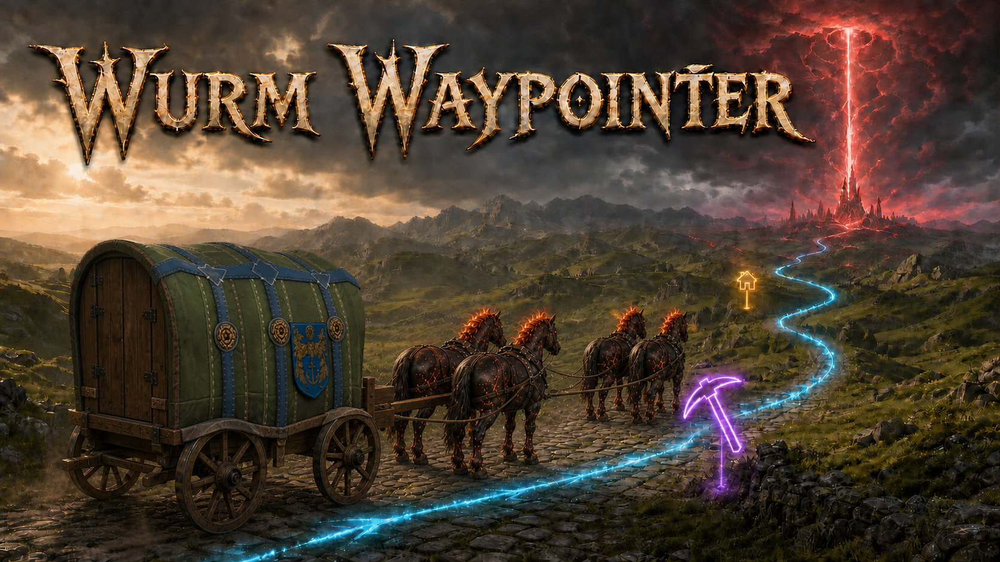

# Wurm Waypointer

**Wurm Waypointer 1.5.3** is a client-side navigation and map mod for Wurm Unlimited, created especially for Sklotopolis.

Its main purpose is to let you create waypoints and navigate to them using a glowing, magic-like navigation pulse. Choose your destination and follow the light!

## New in 1.5.3

- Replace the old updater with Avatar 2.0's **Mods Registry by Chamomilo**: compact mod cards, descriptions, project links, **DOWNLOAD** actions and disabled **LATEST** buttons, with matching wood-and-iron artwork.
- Open the registry at any time through **Main menu > Mod updates**. **Don't show on next start** saves your startup preference in `.chamomilo/updater.properties`; version checks and the menu entry remain available. Downloads open ZIPs for manual installation.
- Remove the old Waypointer updater host and report the current runtime version consistently with the packaged mod descriptor. The shared protocol remains compatible with other Chamomilo mods; the first loaded updater copy determines the interface.

## Included from 1.5.2

- CAVE reinforcement uses two short orange lines on the right and bottom; structures use two short pink lines on the top and left. Both leave the corners clear and remain visible at every zoom level.

## Included from 1.5.1

- The compact **- / interval / +** control adds mini-map height contours; **Topographic view** appears in its hover text. All footer controls have the same height, and the mini-map metre scale is removed. Click -/+ or type a two-digit interval of **1–99 metres** to rebuild immediately; **0** turns contours off. Dense one-metre contours cover the complete received area while keeping the frame and markers visible. GROUND uses received terrain heights, CAVE uses received floor heights. Unknown terrain has no invented contours.
- **FULL MAP** is now a compact button to the right of GROUND/CAVE. The footer row is centred with equal gaps and visible metal corner plates.
- The full map's **Zoom speed: 1X** button cycles **1X → 2X → 4X → 1X**. It multiplies the original wheel step on the full map and both mini-map layers without changing their zoom limits.
- The player heading arrow keeps the original maximum full-map zoom size at every zoom level, including its outline, on the full map and both GROUND and CAVE mini-map layers.
- Ordinary tile grid lines appear only at maximum zoom on the full map and both mini-map layers, disappearing on the first zoom-out step. Orange reinforcement and pink structure edge marks remain visible in CAVE at every zoom level.
- Underground iron ore is dark red; copper ore is green.

## Included from 1.4.3

- Restored the complete NAV route on the surface map, including underground sections and cave approaches to the selected exit.
- Underground map segments keep the waypoint colour with 50% desaturation; surface segments keep the normal colour. The CAVE mini-map keeps its regular underground line.
- Cached map lines also preserve routes entirely underground.
- Replace the player cross with a live rotating heading arrow on the full map and both mini-map layers, sized to one map tile.

## Included from 1.4.2

- NAV approaches join the highway where they actually reach it, including when the initially selected entry cannot be reached.
- Missing distant highway terrain preserves the received highway prefix and the published map continuation instead of discarding the complete journey.
- Incomplete near-terrain corners fall back to available distant terrain.
- The cave mini-map shows the underground route; the surface map shows the continuation from the selected cave exit. Tunnel segments retain their layer and never connect separated surface spans through a cave.
- Already built surface routes remain visible during player-layer changes and cave receipt gaps; switching the target or stopping NAV clears the cached line.
- Detailed NAV logs include highway attempt results, actual approach endpoints, missing terrain coordinates and blocking coordinates.

## Included from 1.4.1

- Fixed junctions on the second highway lane and unnecessary trips to bridge/tunnel endpoints when changing lanes.
- Removed repeated branch excursions and overlapping terrain-leg loops from NAV routes.
- Kept the usable highway journey when only the final approach is incomplete, preserving highway preference over distant off-road shortcuts.
- Added routing to a reachable received cave exit when navigating to a surface target from a cave without a published highway. Unreceived cave floors and exits remain unknown.
- Cross-layer map lines use checked approach/target connectors instead of filling missing portions with straight lines.

## Included from 1.4.0

The Chamomilo versions window appears at every launch, including when everything is current or GitHub checks fail. It lists all mods from the public catalogue in [wurm-keybinder/chamomilo-mods.properties](https://github.com/chamomilo/wurm-keybinder/blob/main/chamomilo-mods.properties), verifies public repository membership and detects disabled or unloaded installations. Each row shows installed/latest versions; UPDATE and INSTALL open manual ZIP downloads. New catalogue entries appear without upgrading the updater. The window uses a thinner version of the map's high-resolution wood-and-metal frame.

Verified catalogue data is cached under your user home in `.chamomilo/mod-catalog.properties` for offline startup. All participating mods should include the current shared updater: an earlier-loaded mod with an older copy can still select the older interface.

## New in 1.3.2

- Fixed ore veins and unexcavated rock disappearing behind **Unknown (not received)** in the cave mini-map. All received rock and ore types are now shown even before their floor/ceiling are formed.
- Tile receipt follows the native cave buffer, keeping unreceived and overwritten cells unknown.

## Included from 1.3.1

- Verified the shared Chamomilo protocol-1 updater integration. Release builds now check every packaged updater class and the exact metadata in both the project and the installable ZIP.
- Fixed the Waypointer update name so notifications do not repeat the word Wurm.

## Included from 1.3.0

- The mini-map has a **GROUND / CAVE** button beside **OPEN FULL MAP**. Entering a cave selects CAVE once; leaving selects GROUND once. You can switch manually until the next layer transition.
- CAVE starts at **17×17 tiles**. Mouse-wheel zoom reaches **48×48 tiles**; GROUND keeps its separate zoom setting.
- Tunnels, entrances, water, reinforcement, paving, structures and received ore/rock types are shown in contrasting colours. Zinc, silver and marble have distinct colours and patterns.
- Hover shows the cave tile name, floor/ceiling/clearance, water depth and available reinforcement, paving, cladding and structure information. Ore quality and remaining yield are not supplied by this terrain stream. Unknown tiles remain marked as unknown.
- Waypoints and custom marks created in CAVE are saved on the cave layer.

## Also included from 1.2.2

- Fixed distant NAV routes using repeated local terrain coordinates, which could produce paths across water. Distant surface routes now use the distant terrain data; cave navigation stops where reliable cave data is unavailable.
- Fixed highway entry and exit calculations at junctions, avoiding unnecessary trips into branches and back onto the main road.

## Also included from 1.2.1

- `CENTER` on the full MAP returns the view to your character without changing the zoom. The mini-map follows your character automatically.
- Hover a loaded tree or bush tile on either map to see its age and `Harvestable` when the client reports fruit ready to collect.
- Hover a loaded field tile to see the crop type, growth stage and `Harvestable` for ripe crops. These details are available only within the client's live terrain range; distant map images do not contain crop or tree state.
- The mini-map title is centred, and `OPEN FULL MAP` sits two pixels lower.
- A shared Chamomilo update notification lists available mod releases and opens their ZIP download links for manual installation.

## Main features

1. **Waypoints**
   Create permanent or temporary waypoints and customize their size, pictogram, color, or white-light beam style. Waypoints can notify you when you arrive. You can also share them through chat, import waypoints shared by other players, or create one from a `/gps` message. An active Loot Map waypoint also appears in the Manager: switch it `Off` to hide it without losing hunt progress, then switch it `On` to restore it.

2. **Sklotopolis maps in-game**
   The server maps for all five Sklotopolis worlds are now available directly inside Wurm. Press `M` to see your position, waypoints, deeds, and published highways. While the active surface loads, the stock WO map is replaced by a branded gallery of Liberty, Novus, Caza, Infinity Round 5, and Old Infinity. The full map and mini-map use matching custom wood-and-iron frames and reused healthbar title plates. Use the `DEEDS`, `ROADS`, and `MARKS` buttons beside deed search to hide crowded overlay layers. `MINI MAP` enables a separate player-centred square view which remains independent of the full map; use the mouse wheel over it to change its 80-tile default range between 20 and 160 tiles in responsive eight-tile steps. The borderless mini-map embeds its view width in metres and an `OPEN FULL MAP` button directly in the custom frame. The full-map `DEEDS` and `ROADS` buttons also control settlement boundaries, deed anchor labels, and roads on the mini-map. `NAV LINE` toggles the complete currently planned Navigator path, including cross-layer tunnel continuations, on both maps at every zoom. Hovering keeps coordinates and terrain on the first line, adds deed/interior/perimeter information below it, and identifies nearby waypoints and their state. Left-clicking either map creates a waypoint; right-clicking opens a labelled custom-map-mark editor. Click a deed marker to view its details and use `Nav to deed` to track it and start NAV immediately. Provider-managed `DEED` waypoints keep the same UUID when a deed moves and become visibly `Stale` rather than disappearing when a valid newer catalog no longer contains them. Waypoints and custom map marks are stored in `wurm-waypointer-data`, outside the installed mod directory, and legacy data is migrated automatically.

3. **Casual Loot Map hunting**
   Read your Loot Map and follow the white rabbit! Waypointer uses the readings to estimate the treasure location and tries to minimize the number of readings required. Its route planner can guide you across roads and bridges, through tunnels, and deep inside mountains.

4. **Archaeology Report assistance**
   When you complete an archaeology report, Waypointer rings a bell, helps you request directions, tracks the search, and guides you toward the hidden cache.

5. **Surroundings browser**
   If you have used Bdew's Scanner, the idea will feel familiar. The Surroundings window displays nearby animals, vehicles, containers, and other objects. You can search and filter the list, mark any result with a temporary waypoint, and immediately navigate to it. The **Exclude names** field accepts several comma-separated fragments; an object matching any fragment is hidden, while the empty default hides nothing.

6. **Scanner profiles**
   `/wp scan uniques`, `/wp scan treasure`, and `/wp scan animals` enable ready-made live searches with distinct coloured model highlights. The nearest eight matches within 80 metres can be outlined through walls, and later appearance/disappearance transitions are reported in Event without replaying every already-loaded match when the profile is enabled. Use `/wp scan off` to stop, `/wp scan status` to inspect the active profile, and `/wp scan window` to open Surroundings.

Scanner minus-name rules are generic and session-local: `/wp scan exclude catseye, corpse, pet` adds several fragments, `/wp scan unexclude corpse` removes one, `/wp scan excludes` lists them, and `/wp scan clear-excludes` clears them. No object name is excluded by default. `/wp scan notify on|off|status` and `/wp scan outline on|off|status` control the two presentation channels. Outline count, distance, defaults, and optional startup exclusions can be configured with `scannerMaximumOutlines`, `scannerOutlineDistanceMetres`, `scannerNotifications`, `scannerOutlines`, and `scannerExcludedNames` in `mods/wurm-waypointer.config`.

The Navigator route-statistics window can be closed normally. Its **Navigation signal** selector switches the active route between `Pulse`, `Solid`, and `Moving` and saves the choice in `mods/wurm-waypointer.config`. The same setting is available through `/wp nav style pulse|solid|moving|status`; the older `/wp nav pulse on|off|status` aliases remain available. `/wp nav off` still stops Navigator completely.

## Deed providers

Sklotopolis HTTPS feeds are selected through an explicit endpoint/world table. Other Wurm Unlimited servers can configure plain JSON or CSV feeds with `deedProviderMappings`; both HTTPS URLs and local `file:///...` imports are supported. Each semicolon-separated mapping uses:

`endpoint[|exact world]|<JSON or CSV>|source[|mapWidth|mapHeight]`

Unknown servers, or every server when `deedProviderEnabled=false`, use the explicit `No provider` state. `/wp deeds` opens the current-server picker even on a server without a built-in map. Provider health and data age appear there and in `/wp deeds status`; `/wp deeds refresh` requests a background refresh. Downloads use timeouts, size/schema/bounds checks, conditional HTTP requests, retry backoff, and an atomic last-known-good cache. A malformed or empty refresh never replaces usable cached data.

## Installation

Wurm Waypointer requires a working Wurm Unlimited client modloader.

1. Download the latest ZIP from the [Releases page](https://github.com/chamomilo/wurm-waypointer/releases/latest).
2. Close Wurm Unlimited.
3. Extract the ZIP into your `WurmLauncher` directory and allow the included `mods` folder to merge with the existing one.
4. Start the game normally.

After installation, the mod should be located at:

`WurmLauncher/mods/wurm-waypointer/wurm-waypointer-1.5.3.jar`

When upgrading, keep only the current Waypointer JAR in that folder and check that `mods/wurm-waypointer.properties` points to it. Back up your configuration before extracting an update. Waypoints and custom marks are stored separately in `wurm-waypointer-data` under the client directory.

## Building from source

Use a Java 8 JDK. Copy `local.properties.example` to `local.properties` and set `wurmClientLibDir` to a directory containing your client libraries (`client-patched.jar`, `common.jar`, `javassist.jar`, and `modlauncher.jar`). These proprietary libraries are not included in this repository.

If your Java 8 JDK does not include JavaFX, also set `wurmJavaFxJar` in `local.properties` to your existing Wurm `runtime/lib/ext/jfxrt.jar` for the native updater UI verification. The same path can be passed with `-PwurmJavaFxJar=...` or `WURM_JAVAFX_JAR`; it is used only during verification and is not bundled.

Run `./gradlew test dist` (`gradlew.bat test dist` on Windows). The installable archive is written to `distribution/build/distributions/wurm-waypointer-1.5.3.zip`; the build verifies module boundaries, packaged runtime classes, update metadata, native updater layout/menu behaviour and ZIP contents.

## Chamomilo update checks

After the first game HUD is ready, Waypointer participates in one background check
for all installed Chamomilo mods with protocol-1 update metadata. Whichever mod
claims the shared coordinator first displays one registry with installed and
available stable versions, descriptions and project links. **DOWNLOAD** opens
the mod's ZIP link in your browser, falling back to the latest release page;
**LATEST** is disabled for current or newer installations. Installation is manual.
The registry remains in **Main menu > Mod updates** after closing. Its **Don't
show on next start** checkbox saves a user preference outside the mod directory.
The checker uses network timeouts, and failed checks do not interrupt gameplay.

## Replacing other mods

Wurm Waypointer overlaps with the functionality of several existing mods, including Scanner, custom map mods, and Improved Compass. You can remove those mods or continue using them alongside Waypointer—the choice is yours.

## Feedback

Please try the mod and share your feedback! Bug reports and suggestions will help us make it better.

Download and source code: https://github.com/chamomilo/wurm-waypointer

Special thanks to **Wolfbane** and **FlpSilva** for beta testing, and to **Killerspike** for thoughtful suggestions and detailed bug reports.

Licensed under `GPL-3.0-only`.
